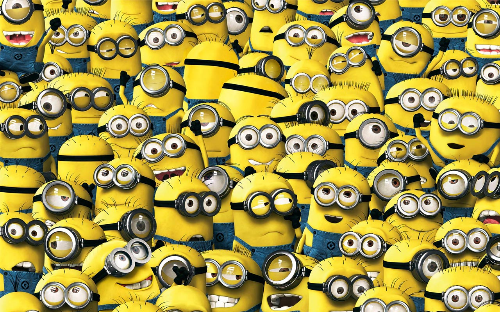
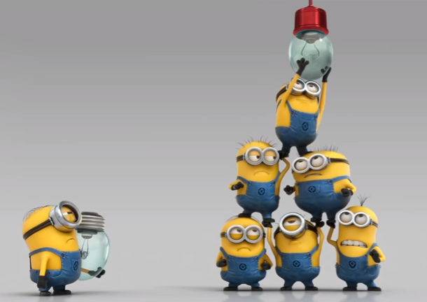
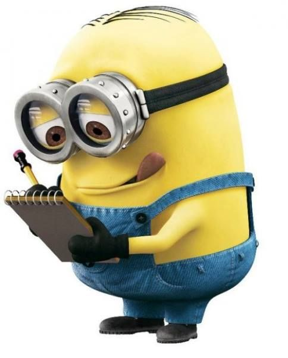

layout: true

<div class="my-header"></div>

<div class="my-footer"><span>
Kevin Rue-Albrecht
&emsp;&emsp;&emsp;&emsp;&emsp;&emsp;&emsp;&emsp;&emsp;&emsp;&emsp;&emsp;&emsp;&emsp;&emsp;&emsp;
BiocChallenges
</span></div>

```{r setup, include=FALSE}
stopifnot(require(htmltools))
stopifnot(require(RefManageR))
stopifnot(require(knitr))
knitr::opts_chunk$set(echo = TRUE)
```

```{r htmltools, include=FALSE}
stopifnot(requireNamespace("htmltools"))
htmltools::tagList(rmarkdown::html_dependency_font_awesome())
```

```{r, load_refs, include=FALSE, cache=FALSE}
options(htmltools.dir.version = FALSE)
BibOptions(
  check.entries = FALSE,
  bib.style = "authoryear",
  cite.style = "authoryear",
  max.names = 2,
  style = "markdown",
  hyperlink = "to.doc",
  dashed = TRUE)
bib <- ReadBib("references.bib")
NoCite(bib, "orchestrating2015")
```

---

# Community spirit

```{r echo=FALSE, fig.align='center', out.width='100%'}

```

---

# A (biased) example

Once upon a conference, four postdocs sat together at a break.

**Postdoc 1:** "There's so much single-cell data out there... Always the same plots... Sometimes I wish we had a Shiny app to visualise any data stored in any `SummarizedExperiment` object."

**Postdoc 2:** "Me too! That would be so helpful to share with collaborators too!"

**Postdoc 3:** "Well, I've written a bunch of Shiny apps before. I'd love to help with that."

**Postdoc 4:** "Do you know about Shiny dashboards? Mind if I set up the app structure?"

**Postdoc 2:** _(Opening up a laptop)_ "All right, let me create a GitHub repository and add you."

**Postdoc 3:** "Great idea! Also, let's create a README and write out wish list of functionality."

**Postdoc 1:** "I'll create a Slack channel to keep the conversation going".

_(By the end of the conference)_ `SummarizedExplorer` was born (and later renamed `iSEE`!).

See the initial README at <https://github.com/iSEE/iSEE/tree/021e3e2>

---

# The benefits of collaborations

.pull-left[
- Combine expertise to overcome issues.

- Discuss and refine ideas.

- Exposure to other perspectives<br/>
  (e.g., setup, workflow).

- Share transferable best practices<br/>
  (e.g., git, unit testing, CI/CD).

- Gain experience with external collaborators.
]

.pull-right[
```{r echo=FALSE, fig.align='top'}

```
]

---

# Work in progress

.x-large-p[
.pull-left[
- Your feedback is welcome

  + Current format
  
  + Additional information for each challenge
]
]

.pull-right[
```{r echo=FALSE, fig.align='center', out.height='100%'}

```
]


---

# What can you do this week?

.pull-left[
## Ideas
<i class="fab fa-github"></i> Check out existing challenges at <https://kevinrue.github.io/BiocChallenges/>.

<i class="far fa-comments"></i> Network and communicate.

- On the conference platform<br/>
  (e.g., lounge, chat).

- On the Bioconductor Slack at <https://community-bioc.slack.com>.

<i class="fas fa-user-friends"></i> Get in touch with like-minded participants and speakers.
]

.pull-right[
## Actions

<i class="fab fa-github"></i> Submit a pull request to add a challenge at
<https://github.com/kevinrue/BiocChallenges/>

<i class="fab fa-github"></i> Contribute to an existing challenge repository.

<i class="fab fa-github"></i> Create new challenge repositories.

```{r echo=FALSE, fig.align='center'}

```
]

---

# References

```{r refs, include=TRUE, echo=FALSE, results="asis"}
PrintBibliography(bib)
```
